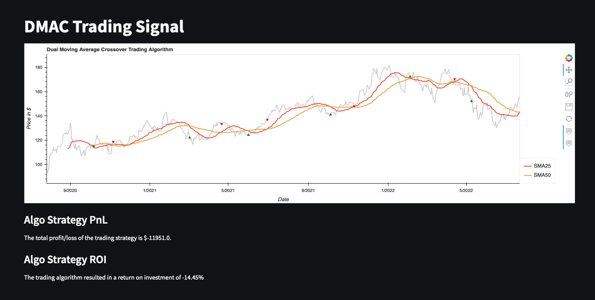

# Financial Market Trading Dashboard

Create a streamlit application with multiple pages containing key information necessary to a trader / investor to make informed decision for investment.

## Details

1) A index & the sector based chart across different timelines to get a macro view.


2) A stock screener like in yahoo finance (we want to limit the pool to nasdaq 100 for simplicity).


3) Real time deeper lens to analyse stock Financials and returns.


4) An algo back testing feature that can run on the above pool of stocks with customizable dates.



## Summary
- We pushed our ability to do real-time integration with Yfinance to provide traders closer real-time experience.

- Lot of challenges in understanding YFinance API in short time and necessiated many pre-processing steps to handle unavailability of data.

- Near real time comparison US region major indicies and across other regions was profound for predictions.

- With less exposure building streamlit application, we are happy to integrate the stock key information and visualization using interactive user experience.

- As icing on the top, Dual moving average crossover trading Algorithm strategy was implemented to visualize profit and loss along with ROI.


## Collaborators

* **Alyssa Younger** 
* **John Ryan** 
* **Kamalnivas Balasubramanian** 
* **Patricia Rajamanickam** 


## Installation Guide
- #### Must have Anaconda base ####

```
conda activate base
conda create -n project3streamlitenv python=3.7 -y
conda activate project3streamlitenv
conda install -c pyviz holoviz -y
conda install -c conda-forge yfinance -y
conda install -c conda-forge html5lib -y
conda install -c conda-forge streamlit -y
conda install -c conda-forge jupyterlab -y
conda install -c conda-forge hvplot -y
conda install -c conda-forge matplotlib -y
conda install -c conda-forge plotly -y
conda install -c conda-forge nodejs -y
conda install -c conda-forge bokeh==2.4.3 -y
conda install -c conda-forge panel -y

```